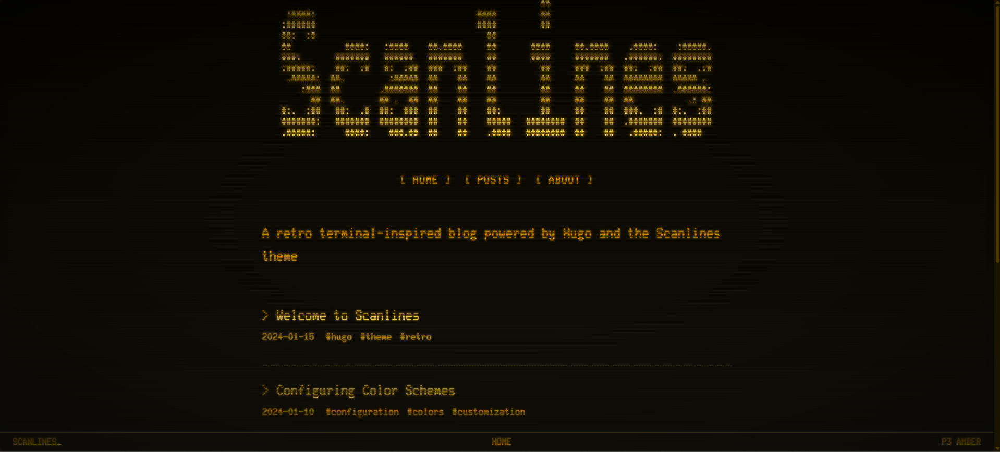
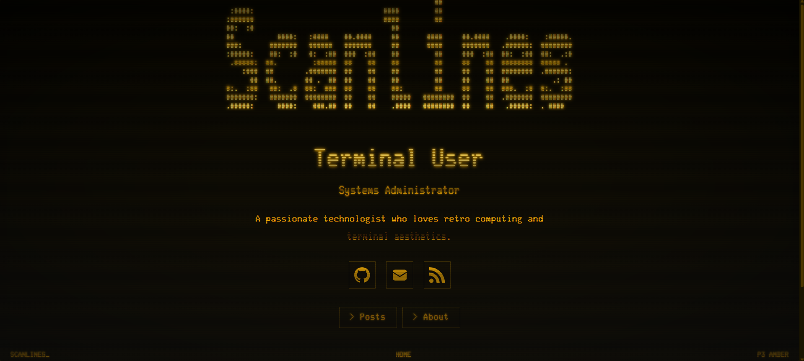
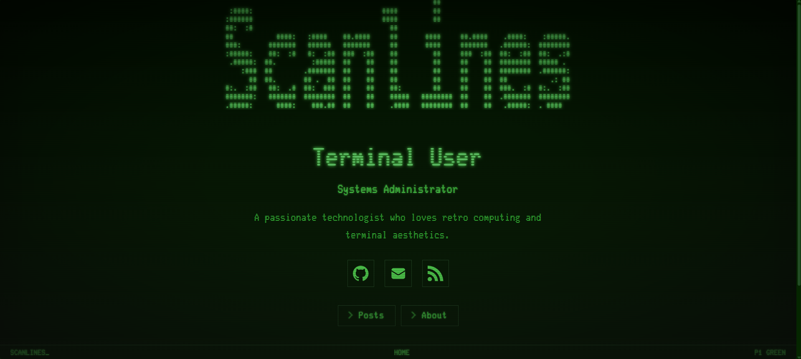
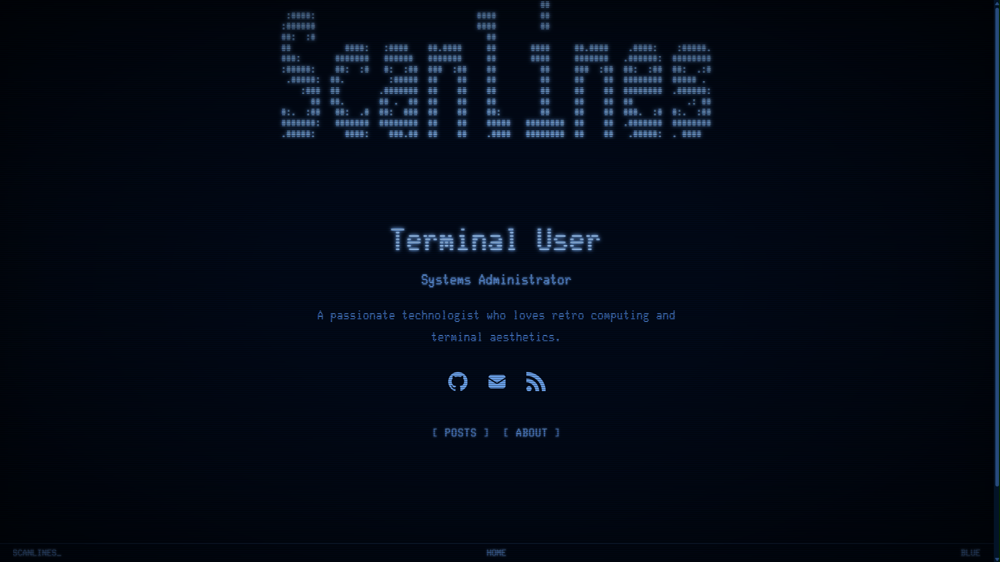
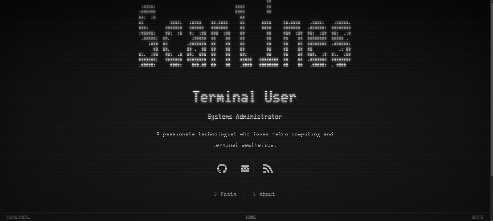
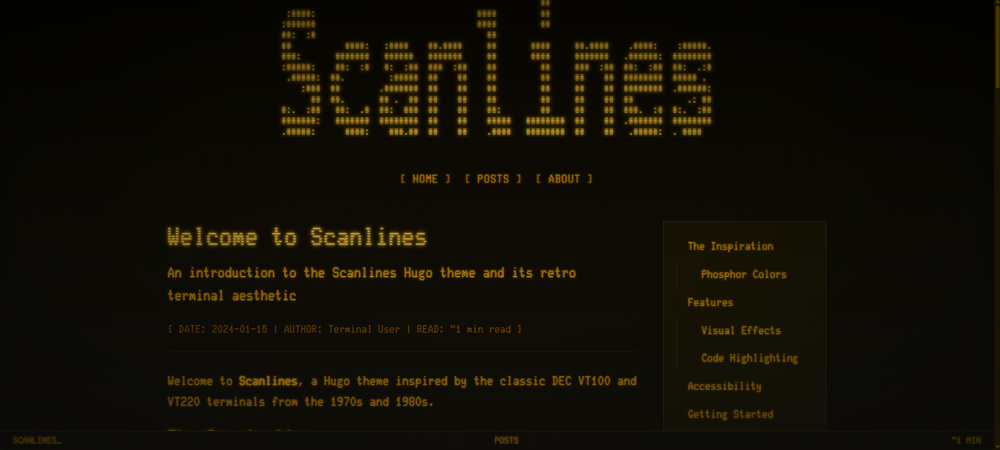
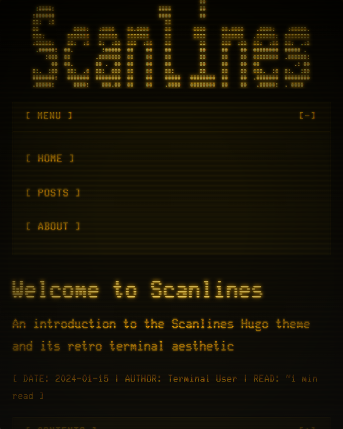

# Scanlines

A retro Hugo theme inspired by the look and feel of classic CRT terminals like the DEC VT220 and VT100. Features historically accurate phosphor color schemes, authentic CRT visual effects, and a clean, minimal design.



## Features

- **Authentic CRT Effects** - Scanlines, phosphor glow, screen flicker, vignette, and screen curvature
- **Historical Color Schemes** - Amber (P3), Green (P1), Blue, and White phosphor emulation
- **VT220 Status Line** - Fixed 25th-line status bar with blinking cursor
- **ASCII Art Header** - Load custom ASCII art from a file for your site title
- **Two Homepage Modes** - Blog (recent posts) or Profile (landing page with buttons)
- **Responsive Design** - Mobile-first with collapsible navigation and TOC
- **Syntax Highlighting** - Chroma integration with monochrome or colored modes
- **SEO Optimized** - Semantic HTML, meta tags, Open Graph, RSS
- **Fully Configurable** - All options namespaced under `params.scanlines`
- **No External Dependencies** - Self-hosted fonts and assets
- **No JavaScript** - Pure CSS effects and interactions
- **Accessibility** - Respects `prefers-reduced-motion`, configurable contrast, VT220-style reverse-video focus

## Quick Start

```bash
# Initialize Hugo module (if not already)
hugo mod init github.com/your-username/your-site
```

Add to your `hugo.toml`:

```toml
[module]
  [[module.imports]]
    path = "github.com/wthouse/scanlines"
```

```bash
# Download/update the theme and start the server (requires hugo-extended)
hugo mod get -u
hugo server
```

## Requirements

- **Hugo Extended** v0.145.0 or later (for SCSS processing)
- No external build tools required

## Configuration Reference

All theme options are namespaced under `[params.scanlines]` in your `hugo.toml`.

### Basic Options

```toml
[params.scanlines]
  # Color scheme: "amber" (default), "green", "blue", "white"
  colorScheme = "amber"

  # Homepage style: "blog" (default) or "profile"
  # "blog"    — site tagline + recent posts
  # "profile" — profile header + buttons (landing page, nav hidden)
  homepage = "blog"

  # Favicon path (relative to static folder)
  favicon = "/favicon.ico"

  # Date format (Go date format string)
  dateFormat = "2006-01-02"

  # Show reading time on posts
  showReadingTime = true

```

### Homepage Modes

**Blog mode** (default): Shows a tagline and recent posts with tags.

**Profile mode**: A landing page with your name, bio, social icons, and configurable buttons. Navigation is hidden — visitors navigate via the buttons you define.



```toml
[params.scanlines]
  homepage = "profile"

[params.scanlines.profile]
  name = "Your Name"
  subtitle = "Your Title"
  avatar = "/images/avatar.png"  # Optional
  bio = "A brief bio about yourself."

  # Buttons shown on profile homepage
  [[params.scanlines.profile.buttons]]
    name = "Posts"
    url = "/posts/"
  [[params.scanlines.profile.buttons]]
    name = "About"
    url = "/about/"
```

### Custom Colors

Override the default color scheme with custom hex values:

```toml
[params.scanlines.colors]
  foreground = "#FFB000"
  background = "#0D0A00"
  backgroundSecondary = "#1A1400"
  accent = "#FF8C00"
  link = "#FFB000"
  linkHover = "#FFD966"
```

### CRT Visual Effects

```toml
[params.scanlines.effects]
  enabled = true           # Master toggle for all effects
  scanlines = true         # Horizontal scanline overlay
  scanlineOpacity = 0.4    # 0.0 - 1.0
  flicker = false          # Screen flicker animation
  flickerIntensity = 0.03  # 0.0 - 1.0 (0.03 barely visible, 0.15 subtle)
  vignette = true          # Phosphor edge fade + subtle screen curvature
  vignetteIntensity = 0.8  # 0.0 - 1.0
  glow = true              # Text phosphor glow
  glowIntensity = 0.8      # 0.0 - 2.0
```

When CRT effects are enabled, images in articles are automatically treated with a grayscale filter and scanline overlay to match the terminal aesthetic. Hover to see the original colors.

### Accessibility

```toml
[params.scanlines.accessibility]
  highContrast = false      # Boost contrast levels
  reduceMotion = false      # Disable all animations
  disableEffects = false    # Turn off all CRT effects entirely
```

The theme also respects the `prefers-reduced-motion` media query automatically.

### Header

```toml
[params.scanlines.header]
  showTitle = true                  # Show site title or ASCII art (default: true)
  asciiFile = "ascii-header.txt"  # ASCII art file in static/ (leave empty for plain text title)
  showBox = true                  # Show border around header (default: true)
```

To use ASCII art, create a text file in your `static/` folder (e.g., `static/ascii-header.txt`). If no file is set, the site title displays as plain text.

### Table of Contents

```toml
[params.scanlines.toc]
  enabled = true
  collapsible = true        # Collapsible toggle
  title = "CONTENTS"
```

### Status Line

The VT220's signature 25th line, shown as a fixed bar at the bottom of the screen. Displays site title, current section, and contextual info (reading time, post count, or phosphor type). Hidden on mobile.

```toml
[params.scanlines.statusLine]
  enabled = true
```

### Layout

```toml
[params.scanlines.layout]
  containerWidth = "1200px"   # Max width of the container
  contentWidth = "720px"      # Max width of the content area (~80 columns)
```

### Typography

```toml
[params.scanlines.typography]
  baseFontSize = "16px"       # Base font size (rem units scale from this)
  fontFamily = "glass"        # "glass" (Glass_TTY_VT220) or "fira" (Fira Code)
```

### Syntax Highlighting

```toml
[params.scanlines.syntax]
  colored = false             # false = monochrome (matches theme)
                              # true = multi-color syntax highlighting
```

### Social Links

```toml
[params.scanlines.social]
  github = "wthouse"
  twitter = ""
  linkedin = ""
  mastodon = ""              # Full URL for Mastodon
  medium = ""                # Username (without @)
  hackthebox = ""            # Profile UUID
  bluesky = ""               # Handle (e.g., "you.bsky.social")
  youtube = ""               # Channel handle (without @)
  discord = ""               # User ID
  steam = ""                 # Custom URL ID
  email = "you@example.com"
  rss = true
```

## Page Types

### Home Page
Configurable as either a blog listing or profile landing page (see Homepage Modes above).

### Blog Posts
Create posts in `content/posts/`. Supports:
- Table of contents (sidebar)
- Tags
- Reading time
- Post navigation (prev/next)

### Static Pages
Create pages in `content/` (e.g., `content/about.md`).

### 404 Page
Custom 404 page with ASCII art.

## Extensibility

### Custom CSS

Create `static/css/custom.css` to add your own styles:

```css
/* Override theme styles */
:root {
  --glow-intensity: 1.5;
}
```

### Custom Head Content

Create `layouts/partials/custom_head.html`:

```html
<link rel="preconnect" href="https://example.com">
<script async src="/js/analytics.js"></script>
```

### Custom Footer Content

Create `layouts/partials/custom_footer.html`:

```html
<script src="/js/custom.js"></script>
```

## Color Schemes

The theme includes four historically accurate phosphor color schemes:

| Scheme | Phosphor | Foreground | Background |
|--------|----------|------------|------------|
| Amber  | P3 (~602nm) | `#FFB000` | `#0D0A00` |
| Green  | P1 (~525nm) | `#33FF66` | `#001A00` |
| Blue   | Cool white  | `#6AAFFF` | `#000A1A` |
| White  | Paper white | `#E6E6E6` | `#1A1A1A` |

| Green | Blue | White |
|-------|------|-------|
|  |  |  |

## More Screenshots

| Single Post with TOC | Mobile View |
|---------------------|-------------|
|  |  |

## Fonts

The theme uses two self-hosted fonts:

- **Glass TTY VT220** (default) - Authentic VT220 terminal font (Unlicense)
- **Fira Code** (optional) - Modern monospace alternative (OFL)

## Browser Support

- Chrome/Edge 88+
- Firefox 78+
- Safari 14+
- Mobile browsers (iOS Safari, Chrome Android)

## Credits

- Inspired by the [DEC VT220](https://terminals-wiki.org/wiki/index.php/DEC_VT220) terminal
- [Glass TTY VT220 Font](https://github.com/svofski/glasstty) by Viacheslav Slavinsky
- [Fira Code](https://github.com/tonsky/FiraCode) by Nikita Prokopov

### Themes That Inspired This One

- [PaperMod](https://github.com/adityatelange/hugo-PaperMod) by Aditya Telange - Clean layout patterns, profile mode, and archive page design
- [Terminal](https://github.com/panr/hugo-theme-terminal) by Radek Kozieł - Terminal aesthetic and monospace-first typography
- [BOOTSTRA.386](https://github.com/kristopolous/BOOTSTRA.386) by Chris McKenzie - Proof that retro computing aesthetics belong on the modern web
- [Chicago7](https://github.com/akopdev/hugo-theme-chicago7) by Akop Karapetyan - Retro UI inspiration and nostalgic design sensibility

## License

MIT License - see [LICENSE](LICENSE) for details.

---

Built with [Hugo](https://gohugo.io) | Vibed with [Claude Code](https://claude.ai/code) (Claude Opus 4.6)
